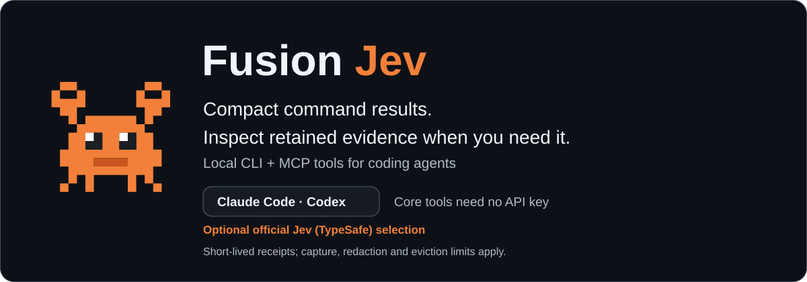
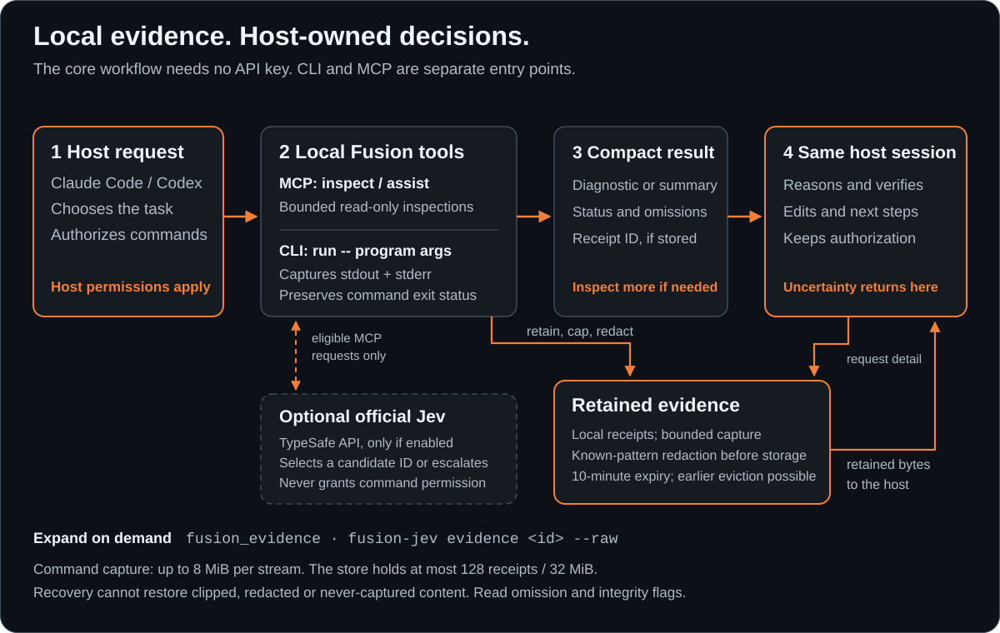
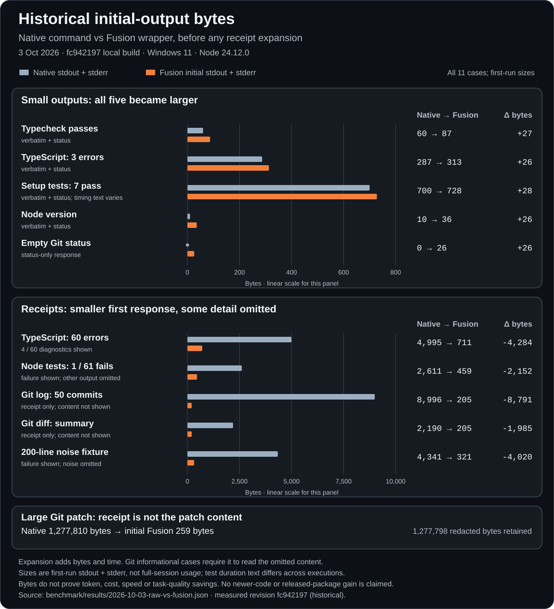

<div align="center">

<picture>
  <source media="(prefers-color-scheme: light)" srcset="docs/assets/hero-v2-light.svg">
  
</picture>

# Fusion Jev

**Find the useful part of a noisy build or test log. Inspect retained output when you need more.**

[](LICENSE)
[](https://nodejs.org)
[](https://github.com/Tlkh201313/fusion-jev/actions/workflows/ci.yml)

</div>

Fusion Jev is a local CLI and MCP server for Claude Code and Codex. Use it when long command output or several repository reads would bury the detail your coding agent needs. The agent gets a compact result and can expand local receipts without rerunning the original command.

The core workflow needs no API key. Your coding agent still owns reasoning, edits, command choice and permissions. Optional official TypeSafe Jev helps select bounded inspection actions through the TypeSafe API. Users with their own official Jev account can opt in; no maintainer-specific router or configuration is required.

**Early-release status:** start in a disposable project with synthetic output. Receipt recovery covers retained captured data; clipping, redaction, expiry and eviction can limit it. Fusion is not an OS sandbox, and running a command through it does not make that command safe.

## When to use it

Try Fusion for a noisy failing build/test, several bounded reads in one inspection, or a result where you want a short view with recoverable detail. Prefer native tools for a tiny one-off read.

### What the tools do

The default `assist` profile advertises three MCP tools:

- `fusion_inspect`: batch up to eight bounded file, search, outline, symbol or Git inspection requests
- `fusion_assist`: gather evidence for a short goal; uncertain work returns to the host
- `fusion_evidence`: expand receipts, or import attributed host research as untrusted data

Command execution uses the **CLI**, `fusion-jev run -- program args...`, through your host's normal command tool. Installing MCP alone does not intercept native commands or guarantee your agent will choose Fusion. Use native tools for a single small read, and Fusion where longer output or batched evidence makes the trial worthwhile.

`FUSION_MCP_PROFILE=full` exposes the larger inspection/routing catalog. The full profile is included in the same package; it is not a paid edition or another install. Keep the default for first use.

## How it works

<p align="center">
<picture>
  <source media="(prefers-color-scheme: light)" srcset="docs/assets/how-it-works-v2-light.svg">
  
</picture>
</p>

1. Your host authorizes a command or selects a bounded inspection.
2. Fusion captures or reads data and returns a bounded result.
3. Local receipts retain captured data for a short time.
4. The host expands a receipt when the compact view is insufficient.

The source preview also has small-output passthrough at 1 KiB or less across complete valid-UTF-8 streams, plus a status line. That later path is not present in the inspected published `0.3.0` CLI. Compact wrappers can add output and startup overhead, especially for small tasks.

[Detailed mechanism and receipt lifecycle](docs/how-it-works.md)

## Which version am I installing?

The public npm registry lists [`fusion-jev@0.3.0`](https://registry.npmjs.org/fusion-jev/0.3.0), checked 3 October 2026. Its metadata points to this repository and names source revision `5dfdd2495e14590dab7412132b4f341f8df2c8fe`. This confirms publication, not a tested install on your machine.

The newer source-preview revision [`ca455469`](https://github.com/Tlkh201313/fusion-jev/commit/ca455469a624f776567de8f336880191b3ce8037) also says `0.3.0`, but contains later code. Installing npm `0.3.0` does **not** install those later changes. Commands below use syntax present in the published package; exact rendering can differ from source-preview examples. Main still uses the provisional package name `fusion-jev-mcp`; it is not the npm package to install.

Before installing, inspect registry metadata without running the package:

```sh
npm view fusion-jev@0.3.0 name version repository.url engines bin dist.integrity --json --registry=https://registry.npmjs.org
```

Expect the name `fusion-jev`, version `0.3.0`, repository `git+https://github.com/Tlkh201313/fusion-jev.git`, Node requirement `>=22.12.0`, and executable `fusion-jev`. Stop if the identity differs. See the [setup prompt](AGENT_SETUP_PROMPT.md) if you want your own coding agent to walk through this safely.

## Requirements

- Node **22.12.0 or newer**, npm, and a terminal
- Claude Code or Codex for MCP use; neither is needed for CLI-only use
- Network access to npm for installation and first `npx` use
- A compatible `better-sqlite3` native binary, or Python and a C/C++ build toolchain if npm must compile it. Native Windows may need Visual Studio C++ build tools.

Check `node --version` and `npm --version` first. Do not bypass permission checks or switch to an administrator installation to hide an error. OS/architecture and host compatibility need verification on your actual setup; the Node engine field alone is not a support matrix. See [installation details](docs/install.md).

## Install the full package

After the metadata and requirements checks above, install the verified published version:

```sh
npm install -g fusion-jev@0.3.0
npm ls -g fusion-jev --depth=0
fusion-jev --help
fusion-jev doctor stdio
```

This installs the **CLI and MCP server together**, including the optional full MCP profile. There is no separate router package to install. Installation executes npm/native-dependency setup; `better-sqlite3` may need Python and a C/C++ toolchain if no prebuilt binary matches your platform. Do not work around an install failure with administrator privileges or disabled checks.

Use `fusion-jev setup --dry-run` to preview durable absolute-path host commands. Ordinary `fusion-jev setup` additionally creates a private provider template/config; it still does not register the host automatically. Confirm the installed executable is on the PATH your coding host sees.

**Alternative, without a global install:** use pinned `npx -y fusion-jev@0.3.0 ...`. This downloads/runs the package via npm's cache; it is not a permanent global CLI. Choose one route deliberately. The fixture below shows both.

## First success: one harmless noisy command

Run this in a disposable directory. It prints synthetic noise and a diagnostic, deliberately exits with code 2, and does not read or edit project files:

```sh
fusion-jev run '--' node -e "for (let i=0;i<200;i++) console.log('unchanged context '+i); console.error('src/example.ts:4:2 - error TS2322: fixture failure'); process.exitCode=2"
```

Without a global install, run the same fixture with `npx`:

```sh
npx -y fusion-jev@0.3.0 run '--' node -e "for (let i=0;i<200;i++) console.log('unchanged context '+i); console.error('src/example.ts:4:2 - error TS2322: fixture failure'); process.exitCode=2"
```

The quoted `'--'` also works in PowerShell. Exit code **2 is expected**. Look for that status, the `TS2322` diagnostic, and a `recoverStdout=` command. Copy the complete recovery command printed by your own run and execute it within ten minutes. It should show the retained synthetic output without rerunning the Node command.

Do not paste a receipt ID from a screenshot or documentation. Receipt IDs belong to a particular run and machine; an abbreviated ID will not work. Check capture/redaction flags before calling recovered output complete. JSON/MCP recovery is paged. CLI `evidence --raw` follows pages and prints all retained bytes from the requested start offset; it cannot restore uncaptured or redacted bytes.

Once that works, try one build or test command you already trust in a project you control:

```sh
npx -y fusion-jev@0.3.0 run '--' npm test
```

Project test scripts can execute arbitrary code. Review unfamiliar scripts first. The sample fixture demonstrates mechanics, not token savings or real-project correctness.

## Connect your coding agent

Choose **one** route. For the global installation above, use the absolute-path host command from `fusion-jev setup --dry-run`. The direct examples below show the pinned `npx` alternative. Adding both an MCP entry and a plugin can duplicate servers. First inspect existing host configuration, then choose the intended project and configuration scope. `setup` prints connection commands; it does not add a server for you.

### Claude Code: MCP only

From the intended project, add a local-scoped server:

```sh
claude mcp add --transport stdio --scope local fusion-jev -- npx -y fusion-jev@0.3.0 stdio
```

Restart or reconnect, then inspect `/mcp`. If Fusion starts in another directory, set `FUSION_WORKSPACE_ROOT` to your project's exact absolute path in the server's launch environment. It defaults to the directory in which the server starts.

Native Windows can have trouble launching the `npx.cmd` shim. Prefer a global installation plus the absolute Node/CLI paths printed by `fusion-jev setup --dry-run`. The `cmd /c npx` workaround and its caveats are in [Windows notes](docs/install.md#windows-notes); it is not verified for every host/version.

[Claude Code MCP reference](https://code.claude.com/docs/en/mcp)

### Codex: MCP only

```sh
codex mcp add fusion-jev -- npx -y fusion-jev@0.3.0 stdio
```

Or add a single table to `~/.codex/config.toml`, preserving unrelated configuration:

```toml
[mcp_servers.fusion-jev]
command = "npx"
args = ["-y", "fusion-jev@0.3.0", "stdio"]
```

Set `FUSION_WORKSPACE_ROOT` in this entry's `env` table to the exact absolute project root when needed. Restart the session and inspect `/mcp`. For native Windows launch failures, use absolute Node/CLI paths after a global installation instead of assuming a shell wrapper works.

[Codex MCP reference](https://learn.chatgpt.com/docs/extend/mcp?surface=cli)

### Optional native adapters

The source preview includes a Claude plugin with skills and hooks, and a Codex adapter with usage guidance. Both preview manifests launch `npx -y fusion-jev@0.3.0 stdio` under the server key `fusion`, so they still run the published package.

The Claude preview's marketplace is `fusion-jev`, while current main's marketplace is `fusion-local`. A default-branch marketplace install does not fetch the preview automatically. To inspect the preview adapter, use the exact checked-out source and its [Claude guide](plugin/fusion-jev-claude/README.md); do not substitute an unverified marketplace command. The [Codex adapter guide](plugin/fusion-jev/README.md) describes its local import workflow. MCP-only is the simpler first trial.

Claude's preview hooks can suggest Fusion, and can deny an oversized whole-file Read once per file/session. They do not authorize commands or rewrite them. `FUSION_HOOKS=off` disables that plugin's guidance. Codex's adapter supplies instructions; it has no equivalent Fusion hook implementation.

### Verify activation, not just registration

```sh
npx -y fusion-jev@0.3.0 doctor stdio
```

Doctor checks local configuration without calling a provider. `status: ready` is a local check; `liveConnectivity: not-tested` is expected. A missing optional provider is normal without a key.

Then ask your coding agent:

> Use Fusion to read the first 20 lines of this project's package.json. Show which Fusion tool you called. Do not enable Jev or edit any files.

If this project has no package.json, choose a small non-sensitive text file. Seeing the actual tool call verifies more than a saved server entry. Next, ask it to run the synthetic fixture above through its usual command tool and recover the omitted detail.

## Official TypeSafe Jev, optional

The public integration uses official TypeSafe Jev (`jev-latest`) through `POST https://api.typesafe.ai/v1/systemone` with your own TypeSafe key. No alternate provider endpoint or maintainer-specific setup is required. See the [official API reference](https://docs.typesafe.ai/api), [quick start](https://docs.typesafe.ai/introduction/quickstart), and [model/version guide](https://docs.typesafe.ai/models).

### Already using official Jev?

Use your **own existing TypeSafe key** from your local environment or a trusted private provider file. You do not need another provider account, router install or maintainer configuration. Never paste a key into chat or a command argument.

After a global install, `fusion-jev setup` creates a local private template and prints its path. Edit that file locally to set `TYPESAFE_API_KEY`, or keep using an existing trusted file with `fusion-jev config env-file /absolute/path/to/provider.env`. Do not print the file's contents. Restart the MCP connection after changing its provider configuration.

The default `assist` profile keeps the tool surface small. To expose explicit choice/routing tools (`fusion_choose`, `fusion_choose_batch`, `fusion_route`, `fusion_route_batch`) as well as inspections, set `FUSION_MCP_PROFILE=full` in the server's launch environment and reconnect. This changes the tool catalog in the same installed package. It does not grant extra filesystem permission.

Doctor can confirm a key is configured, but makes no provider request. A keyless fixture or local inspection does not prove Jev is active. A real Jev check requires an explicitly approved request, with its task data and possible TypeSafe charge understood; see [configuration](docs/configuration.md).

### Credentials, cost and privacy

No provider key is needed for local inspection or command capture. With an explicitly configured `TYPESAFE_API_KEY`, TypeSafe Jev can select an ID from bounded candidate actions. It cannot grant permissions or invent arbitrary commands. Provider requests can send task text and candidate descriptions to TypeSafe, and may incur charges. Review [configuration](docs/configuration.md) before enabling it.

Keep secrets out of shell arguments, manifests, screenshots, issues and public logs. Use a trusted private provider file if you choose to configure Jev; never commit it. Known-secret redaction is best effort and does not guarantee output is secret-free. Your coding host may transmit tool results to its own model service independently of Fusion.

Fusion Jev is an independent community integration, not an official TypeSafe product or endorsement.

## Update and remove

### Inspect installed and available versions

```sh
npm ls -g fusion-jev --depth=0
npm view fusion-jev version --registry=https://registry.npmjs.org
```

There is currently **no** `fusion-jev --version`, `fusion-jev update`, or built-in outdated-version notice. `npm ls` describes the global install; it does not identify a pinned `npx` process, plugin copy or source checkout. Check the actual host command and version pin too.

### Upgrade deliberately

For a global install, inspect the new version's metadata and release notes, then run `npm install -g fusion-jev@VERSION`, replacing `VERSION` with the reviewed exact version. `npm install -g fusion-jev@latest` deliberately follows npm's latest tag; use it only if that is your intent. Restart the MCP connection and repeat doctor, fixture and recovery.

Pinned `npx` entries and preview adapters stay on `0.3.0` until their pins change. A global upgrade does not update them. Change only the relevant host entry or update the adapter through its verified install source, then inspect the resulting command. To roll back, restore the prior exact package version and host pin. No update should silently broaden roots, enable a provider, or change unrelated settings.

### Uninstall

- Direct Claude MCP entry: inspect `claude mcp get fusion-jev`, then `claude mcp remove fusion-jev --scope local` for the local-scoped example above. Use the actual scope if different.
- Direct Codex entry: inspect `codex mcp --help` for your version's removal command, or remove only `[mcp_servers.fusion-jev]` and its child tables from the same config file you edited.
- Claude plugin: use `/plugin` → Installed → the actual Fusion plugin → Uninstall at its original scope. Do not remove the entire marketplace if other plugins depend on it.
- Codex adapter: remove that adapter through the same local plugin workflow used to add it.
- Global package: `npm uninstall -g fusion-jev`.

Restart the host and verify Fusion is gone while other tools still work. Uninstallation does not imply receipt/configuration deletion. Optional cleanup locations: `${XDG_CACHE_HOME:-~/.cache}/fusion-jev-mcp/evidence` and `${XDG_CONFIG_HOME:-~/.config}/fusion-jev-mcp` on Linux/macOS; `%LOCALAPPDATA%\fusion-jev-mcp\evidence` and `~/.fusion-jev-mcp` on Windows. `FUSION_CONFIG_HOME` can change the configuration base. Inspect the resolved paths and back up wanted settings before deleting only Fusion-owned data. Do not clear the whole npm cache or another tool's configuration.

## Limits and measurements

- Receipts expire after **10 minutes**; a **128-receipt / 32 MiB** store can evict them sooner.
- Default capture limit is **8 MiB per stream**. Recovery cannot restore bytes that were never retained or were redacted. The supported capture override can change that limit.
- Evidence pages are at most **64 KiB**. Large receipts require pagination; stale or missing evidence needs explicit handling.
- Workspace roots are exact configured directories, not every directory your host can access. Extra roots are opt-in via `FUSION_WORKSPACE_ALLOWED_ROOTS` (`:` on Linux/macOS, `;` on Windows).
- Parser summaries, approximate outlines and Jev confidence gates are not correctness guarantees. Inspect underlying evidence for decisions that need it.
- Historical [direct-output results](benchmark/results/2026-10-03-raw-vs-fusion.md) and [Claude session results](benchmark/results/2026-10-03-real-host-claude.md) were recorded on `fc942197`, not the npm artifact or this source-preview revision. They do not establish universal token, cost or speed savings.
- The small host study has task/environment differences, no observed MCP calls, and an arm that did not use Fusion. Direct-output totals are dominated by a large Git patch whose details require expansion. Small outputs can grow. Treat these as initial observations, not launch claims.

<p align="center">
<picture>
  <source media="(prefers-color-scheme: light)" srcset="docs/assets/benchmark-initial-bytes-light.svg">
  
</picture>
</p>

This graph plots historical initial CLI output only. It excludes receipt-expansion bytes/time and does not measure the currently published package.

[Measurement protocol](benchmark/real-host.md) · [Comparison with RTK and Context7](docs/comparison.md) · [FAQ](docs/faq.md)

## Develop from the intended source revision

Use an isolated checkout for preview evaluation. Confirm the intended revision rather than assuming main contains the preview:

```sh
git clone https://github.com/Tlkh201313/fusion-jev.git
cd fusion-jev
git checkout --detach ca455469a624f776567de8f336880191b3ce8037
npm ci
npm run check
npm run pack:smoke
```

These commands install dependencies and execute project code; review the checkout first. They are a contributor verification path, not evidence they passed on your platform. Use `node dist/cli.js setup --dry-run` after a successful build for local absolute-path connection instructions. Source npm scripts may load `.env`; do not inherit private provider credentials into preview tests.

[Docs index](docs/README.md) · [Contributing](CONTRIBUTING.md) · [Security](SECURITY.md) · [Changelog](CHANGELOG.md) · [MIT license](LICENSE)

<!-- Keep the existing hero.svg, how-it-works.svg and before-after.svg assets in the repository; this README uses reviewed v2 replacements. Add an actual recorded demo only after install/activation/recovery verification; do not use generated performance art as measurement evidence. -->
