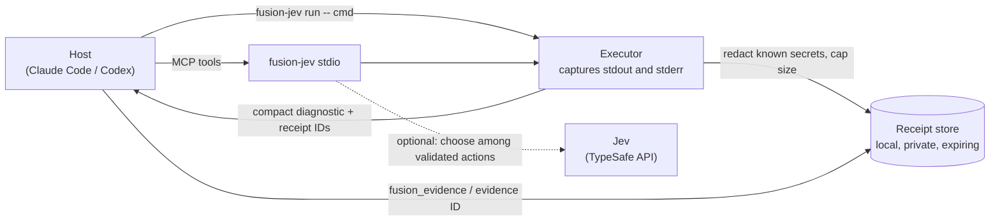

<div align="center">

# Fusion Jev

**Keep noisy command output small. Recover the captured evidence when you need it.**

[](https://www.npmjs.com/package/fusion-jev)
[](https://github.com/Tlkh201313/fusion-jev/actions/workflows/ci.yml)
[](LICENSE)
[](https://nodejs.org)
[](https://modelcontextprotocol.io)

</div>

Fusion Jev is a local CLI and [MCP](https://modelcontextprotocol.io) server for **Claude Code** and **Codex**. It runs a command for your coding agent, hands back a compact diagnostic instead of the full log, and keeps the original bytes behind a short-lived receipt you can expand on demand. No key or account is needed for the core tools.

<!-- TODO(human): record docs/assets/demo.gif (vhs or asciinema) running the fixture below, then uncomment:
<p align="center"></p>
-->

## See it work

A deliberately failing command with 200 lines of noise and one real error:

```sh
npx -y fusion-jev run '--' node -e "for (let i=0;i<200;i++) console.log('unchanged context '+i); console.error('src/example.ts:4:2 - error TS2322: fixture failure'); process.exitCode=2"
```

The host sees a compact result (real output, receipt IDs shortened, path-bearing `recover*Argv` lines omitted):

```text
termination=exit exitCode=2 stdout=f73fce41-… stdoutStoredBytes=4290 stderr=e7162f21-… stderrStoredBytes=51 durationMs=93
omittedBytes=4290 diagnosticsOmitted=0 unparsedBytes=0
src/example.ts:4:2: error: fixture failure [e7162f21-…:0-50]
recoverStdout=fusion-jev evidence f73fce41-… --raw
recoverStderr=fusion-jev evidence e7162f21-… --raw
```

The process exit code (2) is preserved. All 4,290 bytes of stdout stay available:

```sh
npx -y fusion-jev evidence f73fce41-… --raw   # prints the original 200 lines
```

## Install in 30 seconds

Needs Node 22.12+ and npm. Nothing else is required.

### Claude Code

```sh
claude mcp add fusion-jev -- npx -y fusion-jev stdio
```

Or install the plugin, which adds a short usage hint at session start:

```text
/plugin marketplace add Tlkh201313/fusion-jev
/plugin install fusion-jev@fusion-jev
```

### Codex

```sh
codex mcp add fusion-jev -- npx -y fusion-jev stdio
```

Or add this to `~/.codex/config.toml`:

```toml
[mcp_servers.fusion-jev]
command = "npx"
args = ["-y", "fusion-jev", "stdio"]
```

### CLI only

```sh
npx -y fusion-jev run '--' npm test        # quote '--' in PowerShell
npx -y fusion-jev evidence RECEIPT_ID --raw

# or install once
npm install -g fusion-jev
fusion-jev setup        # prints connection commands; use --dry-run to preview
fusion-jev doctor       # local readiness check, no network
```

Then ask your agent: "Use Fusion to read the first 20 lines of package.json." Full steps for every host, Windows notes and troubleshooting: [docs/install.md](docs/install.md).

## What you get

The default profile exposes three MCP tools:

| Tool | Use it for |
| --- | --- |
| `fusion_inspect` | Known file reads, literal searches and Git inspections; batch up to eight independent actions. |
| `fusion_assist` | A short grounded goal when the next bounded inspection is unclear. |
| `fusion_evidence` | Recover captured detail with explicit clipping, redaction and expiry information. |

Commands are run through the CLI wrapper, `fusion-jev run -- program args...`, chosen and authorized by your host. Fusion does not intercept native tools or pick arbitrary shell commands.

## How it works



- **Capture.** The wrapper runs your command, keeps stdout and stderr, and preserves the exit status.
- **Summarize.** Supported diagnostics become short entries with byte ranges; small output is passed through.
- **Receipt.** Captured bytes are stored locally and referenced by ID, so the full output can be recovered without rerunning the command.
- **Escalate.** Anything uncertain goes back to your current host session. Fusion never makes its own model call to Anthropic or OpenAI.

More detail, including the receipt lifecycle: [docs/how-it-works.md](docs/how-it-works.md).

## Jev (optional)

If you set `TYPESAFE_API_KEY`, Fusion can ask TypeSafe's Jev to pick among a short list of pre-validated actions for routine goals. Jev only selects an ID from that list; it cannot write commands, arguments or code, and it cannot grant permission. Without a key, deterministic tools still work and uncertain choices return to your host. See [docs/configuration.md](docs/configuration.md).

## Glossary

- **Host**: the coding agent that runs Fusion, such as Claude Code or Codex. It keeps reasoning, edits, command authorization and correctness decisions.
- **Receipt**: an ID for captured command output or inspection data, stored locally and expandable through `fusion_evidence` or `fusion-jev evidence ID`.
- **Jev**: a model service from TypeSafe ([docs](https://docs.typesafe.ai/api)) that Fusion can optionally consult to choose among validated candidate actions. Fusion Jev is an independent community integration and is not affiliated with TypeSafe.
- **Escalation**: returning an uncertain decision to the host instead of guessing.
- **Profile**: the tool set the MCP server exposes. `assist` (default) has the three tools above; `FUSION_MCP_PROFILE=full` adds routing and inspection tools.

## FAQ

**Does it send my code anywhere?** Local reads, searches, Git inspection and command capture stay on your machine. If you configure a TypeSafe key, Jev receives only the bounded task text and candidate descriptions Fusion sends it; the only network destination the CLI contacts is the official TypeSafe API, and only when a key is set.

**Do I need a key?** No. Compact command evidence and the three tools work without one. A key only enables optional Jev choices.

**What does it cost?** Fusion Jev is free and MIT licensed. Jev requests, if you enable them, are billed by TypeSafe under its terms. Fallback uses your current host session, not a separate API.

**How is it different from RTK or Context7?** RTK's main product is filtering command output across many commands, and it offers its own recall. Context7 retrieves current library documentation. Fusion Jev focuses on MCP tools plus receipts for recovering captured output and bounded inspections. They can coexist. See [docs/comparison.md](docs/comparison.md).

More questions and troubleshooting: [docs/faq.md](docs/faq.md).

## Limits

- Receipts expire after 10 minutes. The store keeps at most 128 receipts and 32 MiB, so older ones can be evicted sooner.
- Each output stream is captured up to 8 MiB. Check `stdoutTruncated` and `stdoutRedacted`: recovery returns the retained bytes, not omitted or redacted content. Redaction matches known secret patterns and is not a guarantee that output holds no secrets.
- Tiny outputs can come back slightly larger than the original because of receipt overhead.
- The evidence store uses `better-sqlite3`, a native module. Installation needs a prebuilt binary for your Node/platform or a local build toolchain (see [docs/install.md](docs/install.md)).
- Token or speed savings have not been measured on real hosts yet. The method and an empty results table are in [benchmark/real-host.md](benchmark/real-host.md); no savings figure is claimed.
- Jev's confidence and probability values are uncalibrated gates, and a configured key is not proof it works.

## Develop

```sh
git clone https://github.com/Tlkh201313/fusion-jev.git && cd fusion-jev
npm ci
npm run check        # typecheck + tests + build
npm run pack:smoke   # install the packed tarball in a clean directory
```

See [CONTRIBUTING.md](CONTRIBUTING.md), [SECURITY.md](SECURITY.md), [CODE_OF_CONDUCT.md](CODE_OF_CONDUCT.md), [CHANGELOG.md](CHANGELOG.md) and the [docs index](docs/README.md). Released under the [MIT license](LICENSE).
