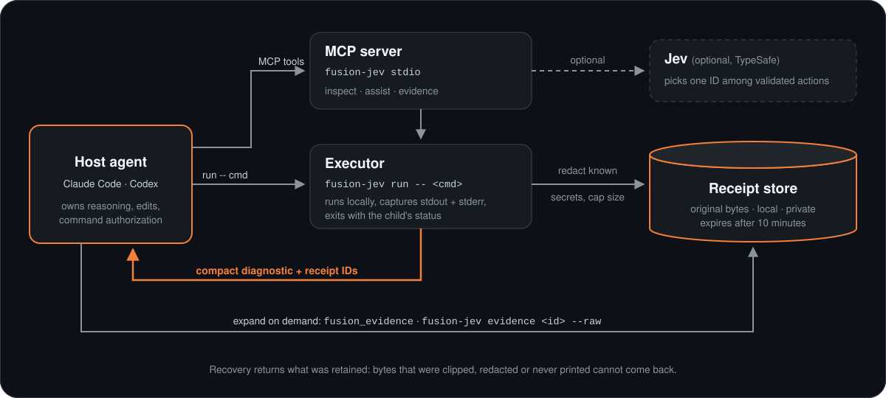
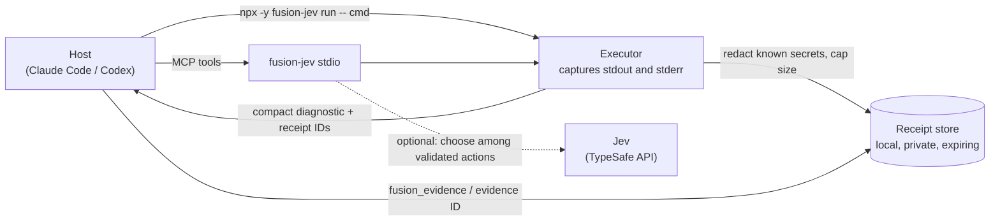

# How it works

Fusion Jev is a thin local layer between your coding agent (the **host**) and the noisy things it reads: command output, files, searches and Git history. It does three jobs: capture, summarize, and let the host recover the original.

## Components

- **MCP server (`fusion-jev stdio`).** Exposes `fusion_inspect`, `fusion_assist` and `fusion_evidence` by default. `FUSION_MCP_PROFILE=full` adds routing and per-operation inspection tools. All inspection tools are read-only and limited to approved workspace roots.
- **Command wrapper (`npx -y fusion-jev run -- program argv...`, or `fusion-jev run ...` after a global install).** The host chooses the command and its arguments, and its own permission system still applies. The wrapper runs the program, captures stdout and stderr separately, summarizes supported diagnostics, and exits with the child's status (124 on timeout, 130 on cancel, 127 if the program cannot be launched). `--raw` prints output directly and creates no receipt.
- **Receipt store.** A private directory in your user cache (`fusion-jev-mcp/evidence`) shared by the CLI and the MCP server when run as the same user.
- **Jev (optional).** When `TYPESAFE_API_KEY` is set, the router can ask TypeSafe's Jev to pick one ID from a bounded list of validated candidates, or to escalate. Jev cannot produce commands, arguments or code, and a choice never grants permission to write.

## Receipt lifecycle

1. **Capture.** Each output stream is captured up to 8 MiB. If more is produced, the stored copy is clipped and flagged `truncated`.
2. **Sanitize.** A short list of known credential patterns (assignments such as `TYPESAFE_API_KEY=...` or `OPENAI_API_KEY=...`, and `Authorization: Bearer ...` headers) is replaced with `[REDACTED]` before storage, and the receipt is flagged `redacted`. This is pattern matching, not a guarantee that output contains no secrets.
3. **Store.** The bytes are written to the private store and given a receipt: a UUID, a SHA-256 of the stored bytes, stored and original byte counts, the `truncated` and `redacted` flags, the source, and an expiry 10 minutes out.
4. **Summarize.** The host receives the receipt IDs plus a compact summary: up to four diagnostics per stream with byte ranges, counts of anything omitted, and the exact text when a stream is small (about 1.2 KB or less) and has no parsed diagnostics. The child's exit status, not log text, decides success or failure.
5. **Recover.** `fusion_evidence` (MCP) or `npx -y fusion-jev evidence ID [--start-byte=N] [--max-bytes=N] [--raw]` returns pages of the retained bytes. Pages are at most 64 KiB; `--raw` follows continuation pages and writes the full retained stream. A page reports one of:
   - `ok`: bytes returned.
   - `stale`: the receipt came from a workspace file that has changed since capture; bytes are what was captured.
   - `expired`, `missing`: the receipt is past its 10-minute expiry, was evicted, or never existed.
   - `hash_mismatch`: stored bytes no longer match the recorded hash and are not returned.
6. **Evict.** Expired receipts are removed. The store also keeps at most 128 receipts and 32 MiB; when over either limit, the oldest receipts are evicted first, so a receipt can disappear before its 10 minutes are up.

Recovery returns what was retained: it cannot bring back bytes that were clipped, redacted, or never printed by the command.

## Inspection

`fusion_inspect` accepts up to eight independent actions per call (file reads, literal searches, Git status/diff/log). Results are bounded and report omissions explicitly. Git inspection reports submodule commit pointers and dirty summaries rather than recursing into submodule contents. `fusion_assist` takes a short goal and picks among prebuilt inspection actions; obvious reads run locally without calling Jev.

## Trust boundaries

- The host owns reasoning, edits, command authorization and correctness decisions. A routing decision alone executes nothing.
- Repository scripts and imported documents are treated as untrusted data.
- Escalation returns control to your current host session. The CLI does not call Anthropic or OpenAI APIs.
- With no key, nothing leaves your machine. With a key, Jev receives the bounded task text and candidate descriptions sent to it. See [configuration](configuration.md) and [SECURITY.md](../SECURITY.md).
